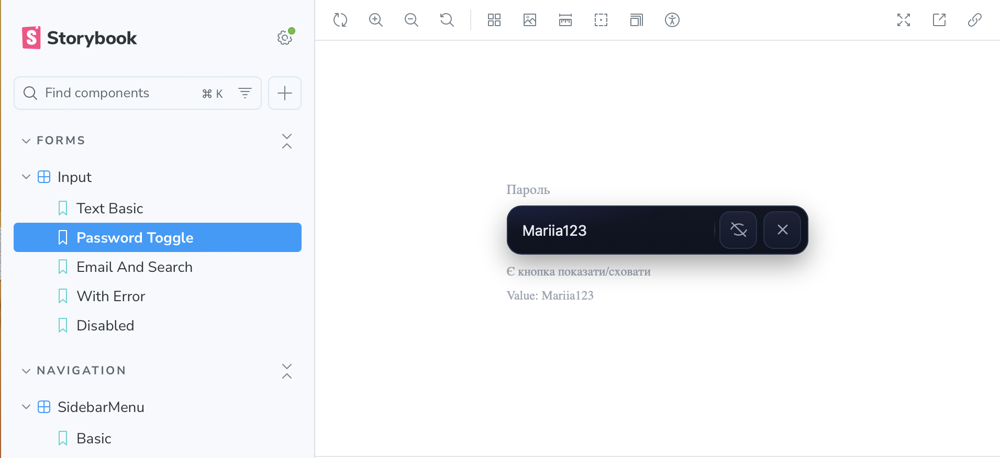

# React UI Library (Storybook)

Small component library built with **React + TypeScript** and showcased in **Storybook**.  
All styling lives in **CSS Modules** (`*.module.css`) — no inline styles in stories.

## Components

- **Input**
  - Types: `text`, `email`, `number`, `password`, `search`
  - Password visibility toggle, clearable (✕), helper text
  - States: error, disabled
- **Toast**
  - Types: `success | error | info | warning`
  - Works standalone or via `ToastProvider`
  - Auto-dismiss + smooth **fade-out** on close
- **SidebarMenu**
  - Nested items (recursive), smooth accordion
  - Animated chevron, basic a11y (`aria-expanded`, `aria-controls`)

## Screenshots





## Getting Started

```bash
npm install
npm run storybook
